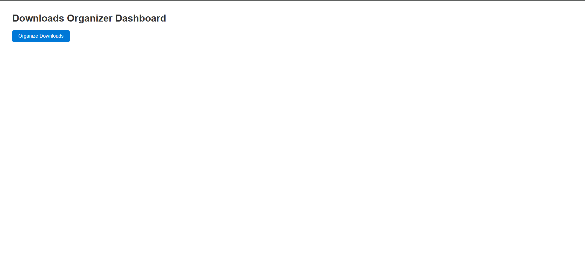
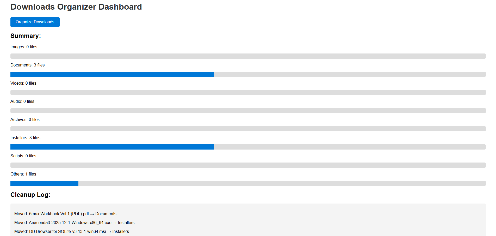

# 📂 Downloads Organizer Dashboard

A Flask-powered dashboard that automatically organizes files in your **Downloads** folder by type.  
No more clutter — with one click, your files are sorted into categories like **Documents, Images, Videos, Installers, Archives, Audio, Scripts, Others**.

---

## ✨ Features
- Organizes files by extension into clean subfolders.
- Dashboard UI with:
  - **One-click cleanup button**
  - **Summary counts per category**
  - **Progress bars** showing distribution
  - **Detailed log** of moved files
- Minimalist design, portfolio-ready.

---

## 🚀 Getting Started

### 1. Clone the repository
```bash
git clone https://github.com/WiraAFauzi/organise_downloads.gitdownloads-organizer-dashboard.git
cd downloads-organizer-dashboard
pip install -r requirements.txt
python app.py
http://127.0.0.1:5000

---

## Screenshots

### Store Front


### Product Page

